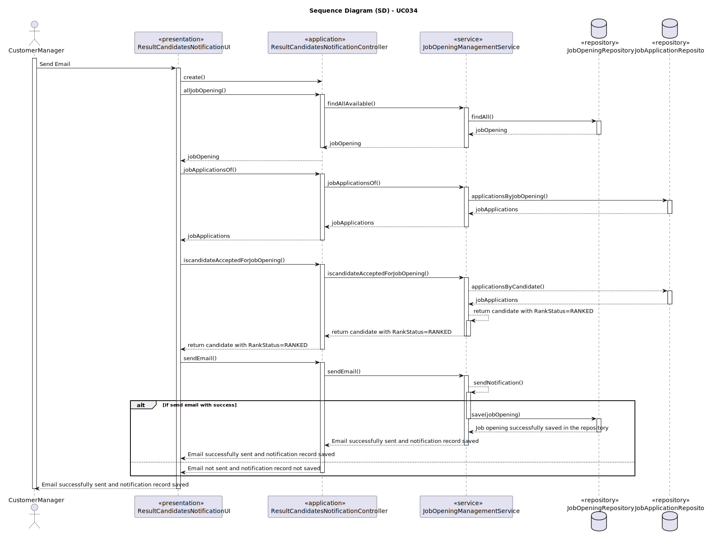
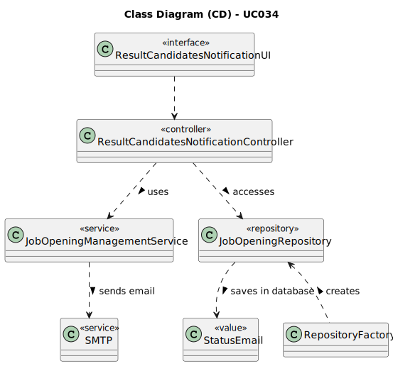

# UC034 -  As Customer Manager, I want to publish the results of the selection of candidates for a job opening, so that candidates and customer are notified by email of the result.

## 3. Design - Use Case Realization

### 3.1. Rationale

| Interaction ID                                       | Question: Which class is responsible for...         | Answer                                 | Justification (with patterns)                                                                          |
|:-----------------------------------------------------|:----------------------------------------------------|:---------------------------------------|:-------------------------------------------------------------------------------------------------------|
| Step 1: Notify Candidates                            | ... triggering the notification process?            | ResultCandidatesNotificationController | Controller: Responsible for controlling the flow of the notification process.                          |
|                                                      | ... searching information about candidates?         | JobApplication                         | Information Expert: Holds and provides candidate information.                                          |
|                                                      | ... fetching the list of candidates?                | JobApplicationRepository               | Information Expert: Provides access to job application data, including candidate details.              |
| Step 2: Send Email                                   | ... sending the email to candidates?                | JobOpeningManagementService            | Service: Provides the service of sending emails to candidates.                                         |
|                                                      | ... sending the email to customer?                  | JobOpeningManagementService            | Service: Responsible for generating the email content.                                                 |
|                                                      | ... providing information for the email content?    | Phase and JobOpening                   | Information Expert: Provide the necessary information for creating the email content.                  |
| Step 3: Save Notification Record                     | ... saving the notification record in the database? | JobApplicationRepository               | Information Expert: Responsible for saving notification records in the database.                       |
| Step 4: Show (in)success of the operation's message  | ... showing the notification (in)success message?   | ResultCandidatesNotificationUI         | Pure Fabrication: Responsible for showing the success or failure message of the notification process.  |

### Systematization ##

According to the taken rationale, the conceptual classes promoted to software classes are:

* Phase
* JobApplication
* JobOpening
* Status
* Candidate

Other software classes (i.e. Pure Fabrication) identified:

* ResultCandidatesNotificationController
* JobApplicationRepository
* JobOpeningManagementService
* ResultCandidatesNotificationUI

## 3.2. Sequence Diagram (SD)

## 3.3. Class Diagram (CD)

