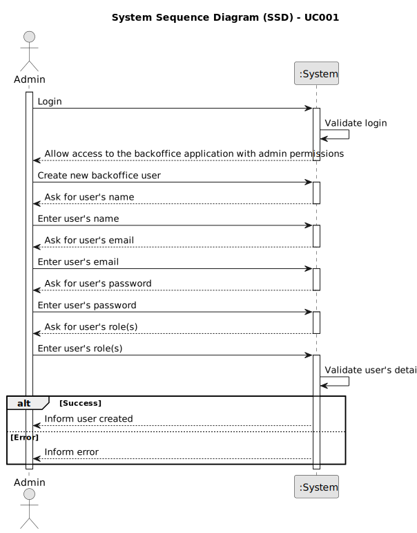

# UC001 - As Admin, I want to register users of the backoffice

## 1. Requirements Engineering

### 1.1. Use Case Description

> As Administrator, I want to be able to register users of the backoffice.

---

### 1.2. Customer Specifications and Clarifications

**From the specifications document:**

- The administrator can perform operations such as registering, disabling/enabling and listing backoffice users, which includes roles such as customer manager, language engineer, and operator.
- The user must provide the following information: name, email, password, and role.
- The backoffice users' registration can be replaced by a bootstrap process that initializes the database with the necessary data to support these users/roles.
- The user's password can be generated by the system.

**From the client clarifications:**

> **Question:** Is the Admin responsible for managing only Customer managers or others, such as Operators? And what does this responsibility mean?
> 
> **Answer:** The idea is that the Admin will manage these users (and at the limit also the Operators).
In practice, the US that refers to these functionalities can be “replaced” by a “bootstrap” process that performs initializations in the database to support these users/roles (as mentioned in the text of the US).

> **Question:** When creating a user in the system, is the name defined by the user or is it the person's name (first and last) and is the password defined by the user or generated by the system?
> 
> **Answer:** Under US 2000a, the Operator creates system users for candidates who are not yet in the system.
You must do this based on the data received in the application (which includes email and name). The email will be used to identify the person.
In this context, it is necessary to have a password for this new user. Since this information is not transmitted by the candidate, I suppose the most “advised” solution would be for the system to generate a password for that user.
How the user/candidate will receive this information (the form of authentication in the app) is out of scope, in the sense that there is no US that refers to this.
US 1000 and 1001 also refer to user creation. Here, one could possibly consider entering passwords manually, but this could be done using the same automatic password definition mechanism, described previously.

> **Question:** Can a person have multiple roles in the system?
> 
> **Answer:** It will be very difficult to control that a person cannot have more than one way of accessing the system (for example, a person who is a Customer Manager could, at the limit, also be a candidate for a job offer).
Regarding “internal” roles, I would say that we should consider a hierarchy of access. The Admin can do “everything” that others do. Next is the Customer Manager and finally the Operator.

---

### 1.3. Acceptance Criteria

> AC001.1: If the user is successfully registered, he/she must be able to log in the backoffice application.
>
> AC001.2: The admin must be able to register a user with the following information: name, email, password, and role (in the backoffice: customer manager, language engineer or operator).

---

### 1.4. Found out Dependencies

* This Use Case is relative to US 1000, which is related to the backoffice users management functionality.
* It relates to the following Use Cases as well:
  - [UC002](../../UC002/README.md) - As Admin, I want to be able to enable users of the backoffice.
  - [UC003](../../UC003/README.md) - As Admin, I want to be able to disable users of the backoffice.
  - [UC004](../../UC004/README.md) - As Admin, I want to be able to list users of the backoffice.

### 1.5 Input and Output Data

**Input Data:**
- Typed data:
	- name
	- email
- Automatic data:
	- password
- Selected data:
	- role

**Output Data:**
- Success or failure of the operation

### 1.6. System Sequence Diagram (SSD)

### 1.7 Other Relevant Remarks

- As said earlier, the user management functionality depends on the system's ability to authenticate users and manage roles appropriately.