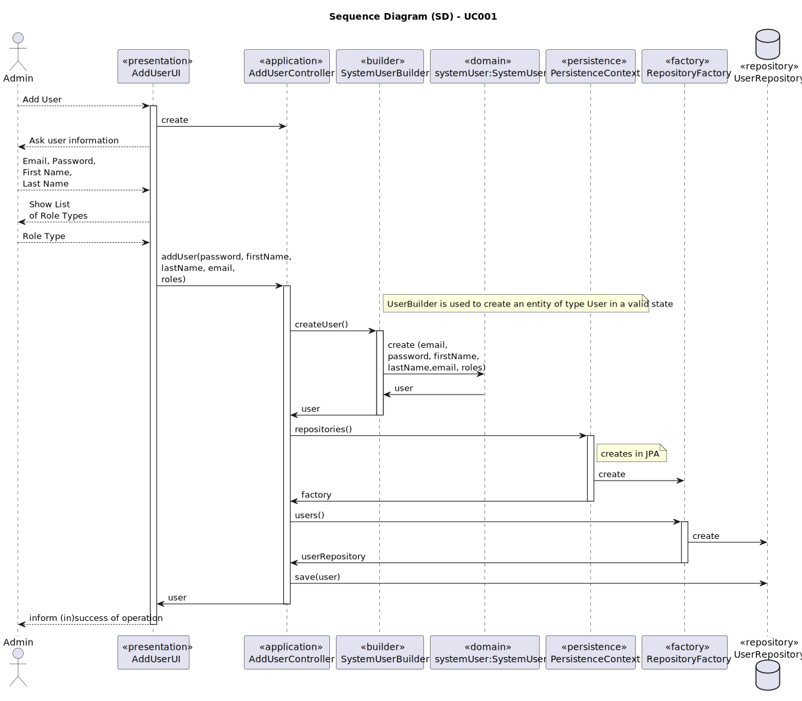
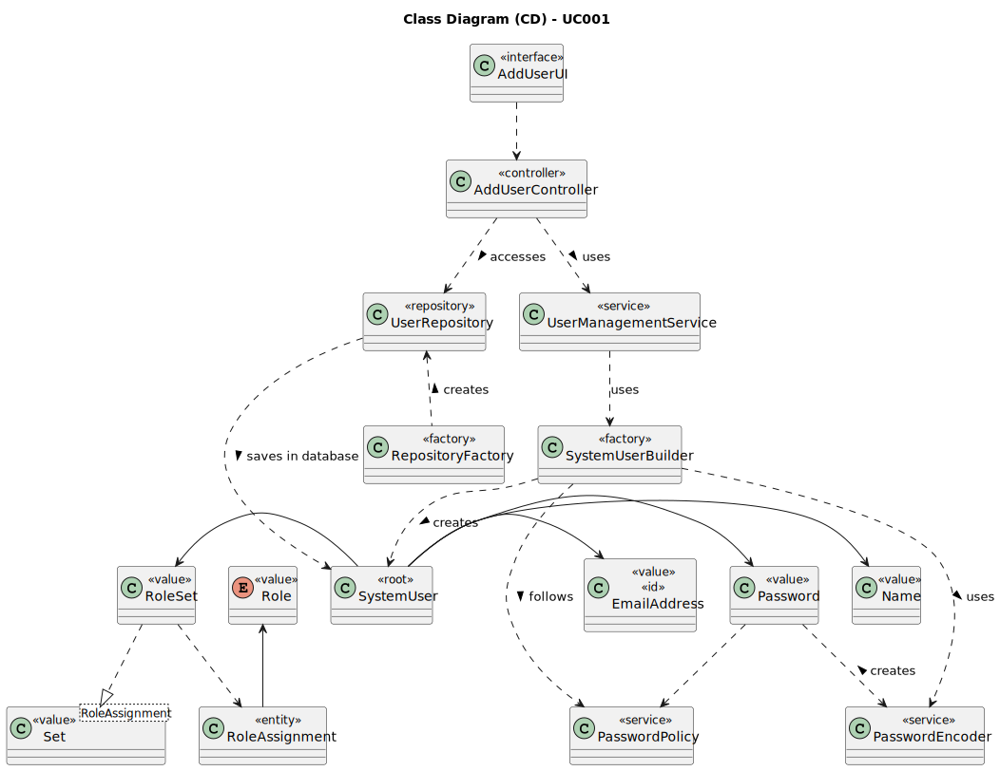

# UC001 - As Admin, I want to register users of the backoffice

## 3. Design - Use Case Realization

### 3.1. Rationale

| Interaction ID                                                            | Question: Which class is responsible for...               | Answer                | Justification (with patterns)                                                                                       |
|:--------------------------------------------------------------------------|:----------------------------------------------------------|:----------------------|:--------------------------------------------------------------------------------------------------------------------|
| Step 1: Login (as Admin)                                                  | ... running the application's console?                    | BaseApplication       | Pure Fabrication: BaseApplication is a class created with the purpose of running a console in our application.      |
|                                                                           | ... showing the backoffice console to do login?           | BaseBackoffice        | Pure Fabrication: BaseBackoffice is a class created with the purpose of showing the backoffice console.             |
|                                                                           | ... showing the login menu?                               | LoginUI               | Pure Fabrication: LoginUI is a class created with the purpose of showing the login menu.                            |
| Step 2: Validate login (as Admin)                                         | ... validating the login credentials?                     | CredentialHandler     | Service: CredentialHandler is a class that provides the service of validating login credentials.                    |
|                                                                           | ... showing the login (in)success message?                | LoginUI               | Pure Fabrication: LoginUI is a class created with the purpose of showing the login success message.                 |
| Step 3: Allow access to the backoffice application with admin permissions | ... giving admin permissions to logged user?              | CredentialHandler     | Service: CredentialHandler is a class that provides the service of validating login credentials.                    |
| Step 4: Create new backoffice user                                        | ... showing the user creation console?                    | AddUserUI             | Pure Fabrication: AddUserUI is a class created with the purpose of showing the user creation console.               |
|                                                                           | ... controlling the flow of the use case?                 | AddUserController     | Controller: AddUserController is a class created with the purpose of controlling the flow of the use case.          |
|                                                                           | ... ensure admin has permissions to create a new user?    | AuthorizationService  | Service: AuthorizationService is a class that provides the service of validating login credentials.                 |
| Step 5: Enter user details                                                | ... communicating with user?                              | AddUserUI             | Pure Fabrication: AddUserUI is a class created with the purpose of showing the user creation console.               |
|                                                                           | ... ensure the new user is valid by checking its details? | SystemUserBuilder     | Factor: SystemUserBuilder is a class that provides the service of validating users.                                 |
|                                                                           | ... keep the user's details                               | SystemUser            | Information Expert: SystemUser has its own details.                                                                 |
| Step 6: Register new user                                                 | ... ensure the new user is not already registered?        | UserManagementService | Service: UserManagementService is a class that provides the service of registering users.                           |
|                                                                           | ... record the user instance in the database?             | UserRepository        | Information Expert: UserRepository is a class created with the purpose of recording user instances in the database. |
| Step 7: Show (in)success of the operation's message                       | ... show the user creation (in)success message?           | AddUserUI             | Pure Fabrication: AddUserUI is a class created with the purpose of showing the user creation success message.       |

### Systematization ##

According to the taken rationale, the conceptual classes promoted to software classes are:

* SystemUser
* Name
* EmailAddress
* Role
* RoleSet
* Password

Other software classes (i.e. Pure Fabrication) identified:

* BaseApplication
* BaseBackoffice
* LoginUI
* AddUserUI
* AddUserController
* SystemUserRepository
* CredentialHandler
* AuthorizationService
* SystemUserBuilder
* UserManagementService

## 3.2. Sequence Diagram (SD)

## 3.3. Class Diagram (CD)

