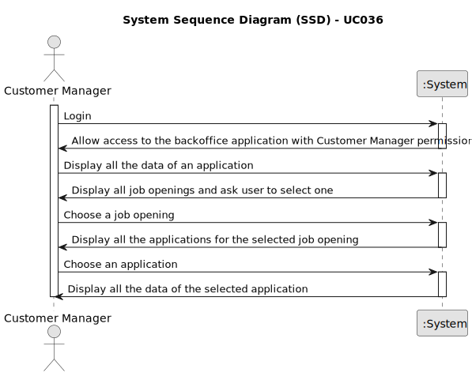

# UC036 — As Customer Manager, I want to display all the data of an application.

## 1. Requirements Engineering

### 1.1. Use Case Description

> As Customer Manager, I want to record the time and date for an interview with a candidate.

---

### 1.2. Customer Specifications and Clarifications

**From the specifications document:**

**From the client clarifications:**

> **Question:** O que é “all data of an application”? O que é uma job application?

> **Answer:** Uma job application é uma candidatura (de um candidato) a uma job opening. Relativamente ao “all data of
> an application” refere-se a todos os dados de uma candidatura, nomeadamente, os ficheiros submetidos pelos candidato
> assim como dados recolhidos ou gerados durante o processo (como as entrevistas e processamento de requisitos).

> **Question:** Relativamente à US1021, como é que a Application a exibir é escolhida? O utilizador pode começar por
> selecionar uma Job Reference e depois o e-mail de um dos candidatos? Ou recomenda uma outra abordagem?

> **Answer:** Devem aplicar melhores práticas de UX/UI. Já houve perguntas anteriores sobre assuntos similares (ex:
> Q150). Note que existe uma US para listar todas as candidaturas a um job opening, por exemplo.

> **Question:**

> **Answer:**

---

### 1.3. Acceptance Criteria

> * The user must be able to see all the data of a job application.
> * The user must be able to see the files submitted by the candidate.
> * The user must be able to see the data collected or generated during the process.
> * The user must be able to see the interviews and requirements processing.
> * The user must be able to select a job application to view its data.

---

### 1.4. Found out Dependencies

* This Use Case is relative to US

### 1.5 Input and Output Data

**Input Data:**

- Typed data:
    - None
- Automatic data:
    - List of job openings
    - List of job applications
- Selected data:
    - Job Application

**Output Data:**

- Success or failure of the operation

### 1.6. System Sequence Diagram (SSD)

### 1.7 Other Relevant Remarks

- As said earlier, the user management functionality depends on the system's ability to authenticate users and manage
  roles appropriately.