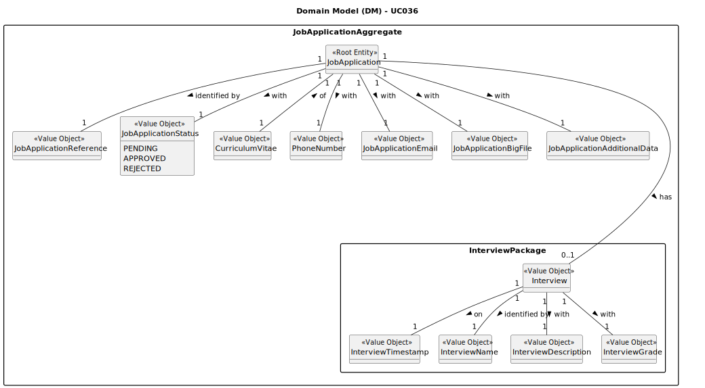

# UC036 — As Customer Manager, I want to display all the data of an application.

## 2. Analysis

### 2.1. Relevant Domain Model Excerpt

The following diagram was extracted from the EAPLI framework (provided by the course's teachers).

### 2.2. Process Specification

#### 2.2.1. Normal Flow
1. The Customer Manager logs into the system.
2. The system allows access to the backoffice application with Customer Manager permissions.
3. The Customer Manager requests to display all the data of an application.
4. The system displays all job openings and prompts the user to select one.
5. The Customer Manager selects a job opening.
6. The system displays all the applications for the selected job opening.
7. The Customer Manager selects an application.
8. The system displays all the data of the selected application.

#### 2.2.2. Exceptional Flows
- **EF001.1**: If the system fails to retrieve job openings, notify the Customer Manager and suggest retrying or contacting support.
- **EF002.2**: If the system fails to retrieve applications for the selected job opening, notify the Customer Manager and suggest retrying or contacting support.

### 2.3. Functional Requirements Reevaluation
- **FR001.1**: The system shall allow the Customer Manager to log in with appropriate credentials.
- **FR001.2**: The system shall grant access to the backoffice application with Customer Manager permissions.
- **FR001.3**: The system shall display all job openings when requested by the Customer Manager.
- **FR001.4**: The system shall display all applications for the selected job opening.
- **FR001.5**: The system shall display all data of the selected application.
- **FR001.6**: The system shall handle exceptions, such as data retrieval failures, with appropriate error messages.

### 2.4. Non-functional Requirements Specification
- **Security**: Ensure secure authentication and authorization for Customer Managers accessing the backoffice application.
- **Performance**: Ensure that job openings and application data are retrieved and displayed within acceptable time limits.
- **Usability**: Provide an intuitive interface that guides the Customer Manager smoothly through the process of viewing application data.

### 2.5. Data Integrity and Security
- Outline security measures for data handling, particularly how sensitive application data is protected in compliance with regulations (e.g., GDPR).
- Detail encryption methods for data storage and secure transmission mechanisms for sensitive data.

### 2.6. Interface Design
- The interface will follow the EAPLI framework's design patterns, providing a user-friendly experience for the Customer Manager.

### 2.7. Risk Analysis
- **R001.1**: Failure to Retrieve Job Openings
  - **Mitigation**: Implement robust data retrieval and error handling mechanisms to ensure job openings are correctly displayed.
- **R001.2**: Failure to Retrieve Applications
  - **Mitigation**: Implement error handling mechanisms to notify the Customer Manager of any failures and provide guidance on how to proceed.
- **R001.3**: Unauthorized Access to Application Data
  - **Mitigation**: Implement secure authentication and authorization protocols to prevent unauthorized access.

### 2.8. Decisions
- **D001.1**: Confirm the need for secure login and permissions management for the Customer Manager.
- **D001.2**: Utilize the EAPLI framework for consistent interface design and functionality.
- **D001.3**: Implement error handling mechanisms to provide feedback to the Customer Manager in case of failures.
- **D001.4**: Use the provided domain model as a reference for managing job openings and application data.
- **D001.5**: Ensure compliance with data protection regulations for handling sensitive application data.
