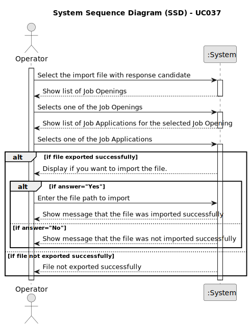

# U037 - As Operator, I want to upload a text file with the data fields (requirements ) of a candidate for its verification.

## 1. Requirements Engineering

### 1.1. Use Case Description

> As Operator, I want to upload a text file with the data fields (requirements ) of a candidate for its verification.

---

### 1.2. Customer Specifications and Clarifications

**From the specifications document:**

> The Operator, after filling in the specific application data (based on the previous template file), submits this file to the system that will be used for the system to evaluate/verify the application. 
> 

**From the client clarifications:**

> **Question:** I'm having trouble understanding where are the requirements answer obtained from the candidates, so that the operator can then register their answers in the template previously generated and submit them to the system. Are these answers already within the files processed by tge application fie bot?
> 
> **Answer:** TWe can assume that the operator has access to all the files submitted by the candidates (since he/she is the one that imports the files into the system – US2002). He/she can than consult these files in order to answer the questions in the requirements template file. She/he then submits the file with the answers.
>

> **Question:** Does US2004 only deals with the upload of the file to the system or also the registration of the candidate's answer by the Operator? I've seen many mentions about the file's answers but I want to understand if that aspect is also part of US2004.
> 
> **Answer:** In US2003 the Operator downloads a template file that he/she uses to register the candidate requirements. In US 2004, the Operator uploads a file with the requirements and the system should validate the file (verify of the syntax is correct). US 1015 is the one that executes the verification of requirements for the candidates (based on the previously uploaded files).
> 

---

### 1.3. Acceptance Criteria

> AC037.1: It must be possible to upload the file with the requirements of the candidate.
>
> AC037.2: The file must be in text format.
>
> AC037.3: The file must be validated by the grammar.
---

### 1.4. Found out Dependencies

* There's a dependency on UC021 - "As Operator, I want to generate and export a template text file to help collect data
fields for candidates of a job opening (so the data is used to verify the requirements of
the job opening).", because the operator needs to have a template file to fill in the candidate's requirements.

### 1.5 Input and Output Data

**Input Data:**
- Typed data:
	- file with the requirements of the candidate
- Automatic data:
	- n\a
- Selected data:
	- n\a

**Output Data:**
- Success or failure of the operation

### 1.6. System Sequence Diagram (SSD)

### 1.7 Other Relevant Remarks

