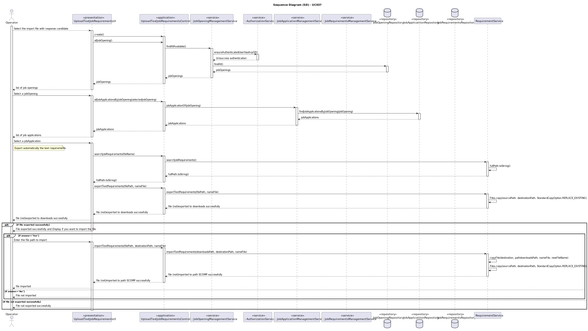
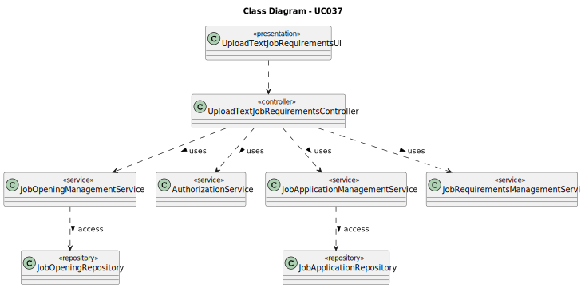

# UC037 - As Operator, I want to upload a text �le with the data fields (requirements) of a candidate for its verification.

## 3. Design - Use Case Realization

### 3.1. Rationale

| Interaction ID                                                                                    | Question: Which class is responsible for...     | Answer                              | Justification (with patterns)                                                                                                |
|:--------------------------------------------------------------------------------------------------|:------------------------------------------------|:------------------------------------|:-----------------------------------------------------------------------------------------------------------------------------|
| Step 1: Login (as Customer Manager)                                                               | ... running the application's console?          | BaseApplication                     | Pure Fabrication: BaseApplication is a class created with the purpose of running a console in our application.               |
|                                                                                                   | ... showing the backoffice console to do login? | BaseBackoffice                      | Pure Fabrication: BaseBackoffice is a class created with the purpose of showing the backoffice console.                      |
|                                                                                                   | ... showing the login menu?                     | LoginUI                             | Pure Fabrication: LoginUI is a class created with the purpose of showing the login menu.                                     |
| Step 2: Validate login (as Customer Manager)                                                      | ... validating the login credentials?           | CredentialHandler                   | Service: CredentialHandler is a class that provides the service of validating login credentials.                             |
|                                                                                                   | ... showing the login (in)success message?      | LoginUI                             | Pure Fabrication: LoginUI is a class created with the purpose of showing the login success message.                          |
| Step 3: Allow access to the backoffice application with customer manager permissions              | ... giving admin permissions to logged user?    | CredentialHandler                   | Service: CredentialHandler is a class that provides the service of validating login credentials.                             |
| Step 4: Want to upload a text file with the candidate responses                                   | ... showing the upload console?                 | UploadTextJobRequirementsUI         | .Pure Fabrication: UploadTextJobRequirementsUI is a class created with the purpose of showing the upload console.            |
|                                                                                                   | ... controlling the flow of the use case?       | UploadTextJobRequirementsController | Controller: UploadTextJobRequirementsController is a class created with the purpose of controlling the flow of the use case. |
| Step 5: Display and select job Opening                                                            | ... showing the job openings?                   | JobOpeningPrinter                   | Pure Fabrication: JobOpeningPrinter is a class created with the purpose of showing the job openings.                         |
|                                                                                                   | ... retrieving the job openings?                | JobOpeningManagementService         | Service: JobOpeningManagementService is a class that provides the service of retrieving job openings.                        |
| Step 6: Display job application list according to selected job opening and select job application | ... showing the job applications?               | JobApplicationPrinter               | Pure Fabrication: JobApplicationPrinter is a class created with the purpose of showing the job applications.                 |
|                                                                                                   | ... retrieving the job applications?            | JobApplicationManagementService     | Service: JobApplicationManagementService is a class that provides the service of retrieving job applications.                |
| Step 7: Export file requirements                                                                  | ... exporting the requirements file?            | RequirementsManagementService       | Service: RequirementsManagementService is a class that provides the service of exporting requirements files.                 |
| Step 8: Import file requirements (if applicable)                                                  | ... importing the requirements file?            | RequirementsManagementService       | Service: RequirementsManagementService is a class that provides the service of importing requirements files.                 |
| Step 9: Show (in)success of the operation's message                                               | ... showing the success message?                | UploadTextJobRequirementsUI         | Pure Fabrication: UploadTextJobRequirementsUI is a class created with the purpose of showing the success message.            |

### Systematization ##

According to the taken rationale, the conceptual classes promoted to software classes are:

* JobOpening
* JobApplication
* Candidate
* JobOpeningRepository
* JobApplicationRepository

Other software classes (i.e. Pure Fabrication) identified:

* BaseApplication
* BaseBackoffice
* LoginUI
* UploadTextJobRequirementsUI
* UploadTextJobRequirementsController
* JobOpeningPrinter
* JobApplicationPrinter
* RequirementsManagementService
* JobOpeningManagementService
* JobApplicationManagementService
* CredentialHandler

## 3.2. Sequence Diagram (SD)

## 3.3. Class Diagram (CD)

