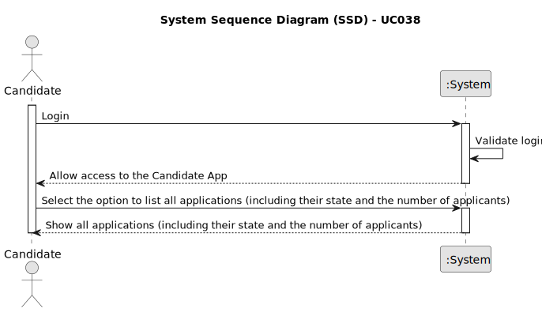

# UC038 - As Candidate, I want to list all my applications and their state (including the number of applicants)

## 1. Requirements Engineering

### 1.1. Use Case Description

> As Candidate, I want to I want to list all my applications and their state (including the number of applicants)

---

### 1.2. Customer Specifications and Clarifications

**From the specifications document:**

- The Operator is responsible for importing applications into the system.
- Applications are registered with approval status "Pending" and can be approved or rejected (after verification of job requirements).
- This Use Case must be achieved by using the Follow Up Server, which is responsible for communicating with the Candidate App and with the database server.

**From the client clarifications:**

> **Question:** US3000 asks, in addition to listing a candidate's applications and their status, to list the number of candidates.
Is this number of candidates a sum of the number of candidates who applied for the same Job Openings as this first candidate (who is executing the use case)?
> 
> **Answer:** All the candidate's “applications” must be listed, their status, as well as the number of applications that each job opening had (so the candidate has an idea of the “competition” they had for each of their applications)

---

### 1.3. Acceptance Criteria

> AC038.1: The system must allow the candidate to list all their applications and their status.
> 
> AC038.2: The system must allow the candidate to see the number of applicants for each of their applications.
> 
> AC038.3: All applications (past and current) must be listed.
> 
> AC038.4: It cannot exist direct communication between the Candidate App and the database server. All communication must be done through the Follow Up Server.

---

### 1.4. Found out Dependencies

* This Use Case is relative to US 3000, which is related to the candidate's applications.
* It relates to the following Use Cases as well:
  - [UC011](../../../SPRINT_B/UC011/README.md) - As Operator, I want to import the files processed by the Applications File Bot.

### 1.5 Input and Output Data

**Input Data:** none

**Output Data:**
- Candidate's aplications, with the following details:
  - Job Application Reference
  - Job Opening Reference
  - Status (Pending, Accepted or Refused)
  - Number of Applicants for the Job Opening

### 1.6. System Sequence Diagram (SSD)

### 1.7 Other Relevant Remarks

- none