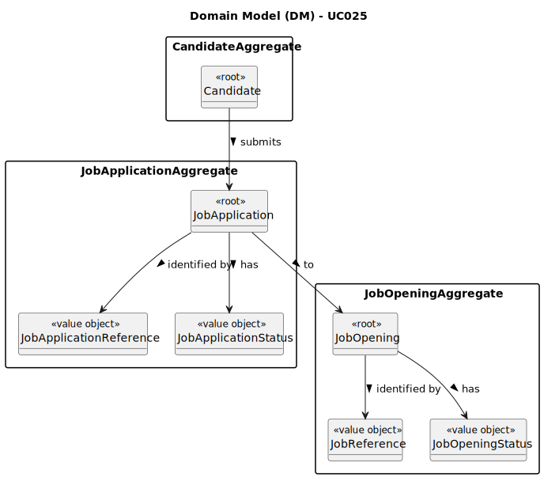

# UC038 - As Candidate, I want to list all my applications and their state (including the number of applicants)

## 2. Analysis

### 2.1. Relevant Domain Model Excerpt

Part of the following diagram was extracted from the EAPLI framework (provided by the course's teachers).

### 2.2. Process Specification

#### 2.2.1. Normal Flow
1. **Authenticate Candidate**: Verify that the Candidate is able to log in to the Candidate App.
2. **Access Application Management Interface**: Candidate navigates to the application management section of its app.
3. **Select the Option to List Applications**: Candidate selects the option to list all of its applications (past and present), including their state and number of applicants.
4. **Send Request to Follow Up Server**: Candidate (client) sends a request to the server to retrieve the candidate's applications.
5. **Retrieve Applications**: The server retrieves the candidate's applications, including their state and number of applicants, and sends them back to the client.
6. **List Applications**: The system lists all the candidate's applications, including their state and number of applicants.

#### 2.2.2. Exceptional Flows
- **EF038.1**: If there is no data, the system shall display a message indicating that there are no applications to list.
- **EF038.2**: If there is an error retrieving the data, the system shall display an error message and prompt the Candidate to try again later.

### 2.3. Functional Requirements Reevaluation
- **FR038.1**: The system shall give the candidate the option to list all of its applications.
- **FR038.2**: Only active candidates can log in to the Candidate App.
- **FR038.3**: The applications' state and number of applicants shall be displayed.

### 2.4. Non-functional Requirements Specification
- **NFR038.1**: Functionalities related to the Candidate App and to the Follow Up Server have very specific technical requirements.
It must follow a client-server architecture,
  where a client application (Candidate App) is used to access a server (Follow Up Server).
Communications between the two components must follow specific protocol described in a document from RCOMP ("Application Protocol").
Also, the Candidate App cannot access the relational database, they can only access the server application.

### 2.5. Data Integrity and Security
- **Authorized Access**: Ensure that user data is stored securely and that only authorized users (in this case, the candidate) can access it.

### 2.6. Interface Design
- The interface will follow the EAPLI framework's design patterns, providing a user-friendly experience for the Candidate.

### 2.7. Risk Analysis
- **R038.1**: Unauthorized Access to User Data
  - **Mitigation**: Implement validation checks within the system to ensure that only the candidate can access its own data.

### 2.8. Decisions
- **D038.1**: Create a new service to retrieve applications (including their state) and calculate their number of applicants (to be used by the Follow Up Server).