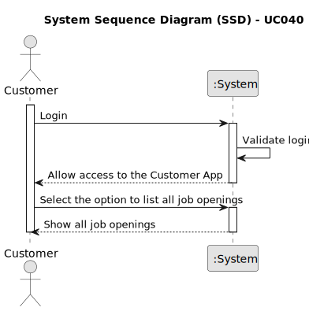

# UC040 - As Customer, I want to list all my job openings, including job reference, position, active since, number of applicants.
## 1. Requirements Engineering

### 1.1. Use Case Description

> As Customer, I want to list all my job openings, including job reference, title, active since, number of applicants.

---

### 1.2. Customer Specifications and Clarifications

**From the client clarifications:**

> **Question:** US3002, lista job openings, position o que é?
> 
> **Answer:** Nessa US quando referimos “position” tem o mesmo significado que “title or function” na secção 2.2.2.

> **Question:** Job Openings Clarifications - You stated that one of the this to show in the listing of job openings is "active since". You've clarified that an active job opening is the one where its recruitment process is on-going. Are the job openings listed in this funcionality only the ones with recruitment process on-going? Or also the ones without recruitment processes, the ones with processes that haven't yet started or have ended?
>
> **Answer:** In the context of this US, “active since” means the date from the start of the process, the “application” phase (since that date, candidates can apply). This functionality should include all the “active” job openings.

---

### 1.3. Acceptance Criteria

> AC040.1: The system must allow the costumer to list all their applications.

### 1.4. Found out Dependencies

* This Use Case is relative to US 3000, which is related to the candidate's applications.

### 1.5 Input and Output Data

**Input Data:** none

**Output Data:**
- Job Reference
- Title
- Active Since
- Number of Applicants

### 1.6. System Sequence Diagram (SSD)

### 1.7 Other Relevant Remarks

- As said earlier, the user management functionality depends on the system's ability to authenticate users and manage roles appropriately.