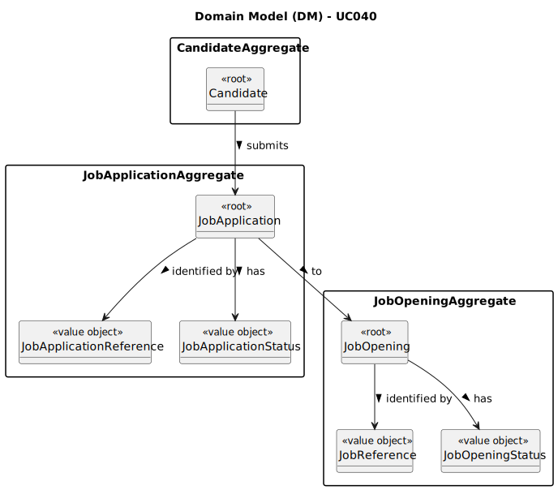

# UC040 - As Customer, I want to list all my job openings, including job reference, position, active since, number of applicants.

## 2. Analysis

### 2.1. Relevant Domain Model Excerpt

Part of the following diagram was extracted from the EAPLI framework (provided by the course's teachers).

### 2.2. Process Specification

#### 2.2.1. Normal Flow
1. **Authenticate Customer**: Verify that the customer is able to log in to the Customer App.
2. **Access Application Management Interface**: Customer navigates to the application management section of its app.
3. **Select the Option to List Job Openings**: Customer selects the option to list all of its job openings (past and present), including their title and number of applicants.
4. **Send Request to Follow Up Server**: Customer (client) sends a request to the server to retrieve the customer's applications.
5. **Retrieve Applications**: The server retrieves the customer's applications, including their title and number of applicants, and sends them back to the client.
6. **List Job Openings**: The system lists all the customer's applications, including their title and number of applicants.

#### 2.2.2. Exceptional Flows
- **EF040.1**: If there is no data, the system shall display a message indicating that there are no job openings to list.
- **EF040.2**: If there is an error retrieving the data, the system shall display an error message and prompt the Customer to try again later.

### 2.3. Functional Requirements Reevaluation
- **FR040.1**: The system shall give the customer the option to list all of its job openings.
- **FR040.2**: Only active customer can log in to the Customer App.
- **FR040.3**: The job opening's title and number of applicants shall be displayed.

### 2.4. Non-functional Requirements Specification
- **NFR040.1**: Functionalities related to the Customer App and to the Follow Up Server have very specific technical requirements.
  It must follow a client-server architecture,
  where a client application (Customer App) is used to access a server (Follow Up Server).
  Communications between the two components must follow specific protocol described in a document from RCOMP ("Application Protocol").
  Also, the Customer App cannot access the relational database, they can only access the server application.

### 2.5. Data Integrity and Security
- **Authorized Access**: Ensure that user data is stored securely and that only authorized users (in this case, the customer) can access it.

### 2.6. Interface Design
- The interface will follow the EAPLI framework's design patterns, providing a user-friendly experience for the Customer.

### 2.7. Risk Analysis
- **R040.1**: Unauthorized Access to User Data
  - **Mitigation**: Implement validation checks within the system to ensure that only the customer can access its own data.

### 2.8. Decisions
- **D040.1**: Create a new service to retrieve job openings (including their title) and calculate their number of applicants (to be used by the Follow Up Server).