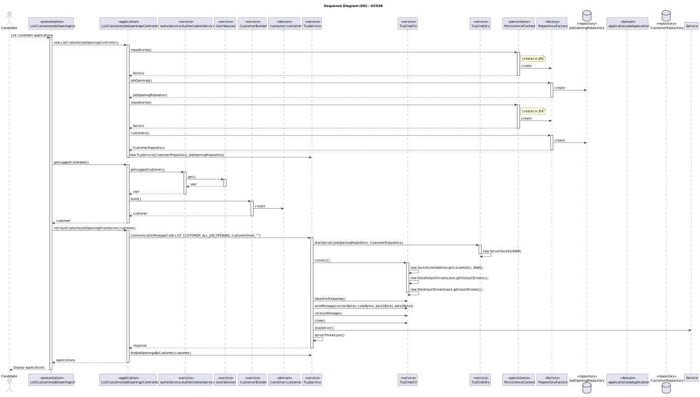
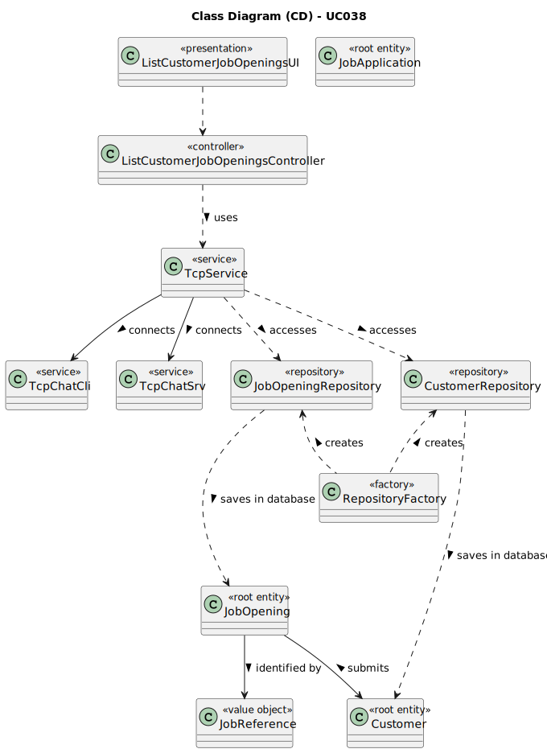

# UC040 - As Customer, I want to list all my job openings, including job reference, position, active since, number of applicants.

## 3. Design - Use Case Realization

### 3.1. Rationale

| Interaction ID                                                                        | Question: Which class is responsible for...                    | Answer                              | Justification (with patterns)                                                                                                                                                                               |
|:--------------------------------------------------------------------------------------|:---------------------------------------------------------------|:------------------------------------|:------------------------------------------------------------------------------------------------------------------------------------------------------------------------------------------------------------|
| Step 1: Login (with signup previously, if necessary) in the customer App             | ... running the job opening's console?                         | BaseApplication                     | Pure Fabrication: BaseApplication is a class created with the purpose of running a console in our application.                                                                                              |
|                                                                                       | ... showing the customer console to do login?                  | BaseUserApp                         | Pure Fabrication: BaseUserApp is a class created with the purpose of showing the backoffice console.                                                                                                        |
|                                                                                       | ... showing the login/signup menu?                             | LoginUI                             | Pure Fabrication: LoginUI is a class created with the purpose of showing the login menu.                                                                                                                    |
|                                                                                       | ... know who is the logged customer?                           | UserSession                         | Information Expert: UserSession knows who is the current logged user.                                                                                                                                       |
|                                                                                       | ... know all existing customers?                               | CustomerRepository                 | Information Expert: CustomerRepository is a class created with the purpose of accessing customer's repository in the database to know all instances of customers.                                           |
|                                                                                       | ... know the logged customer's details?                        | customer                           | Information Expert: customer knows all its details.                                                                                                                                                         |
| Step 2: Validate login                                                                | ... validating the login credentials?                          | AuthenticationCredentialHandler     | Service: AuthenticationCredentialHandler is a class that provides the service of validating login credentials.                                                                                              |
|                                                                                       | ... showing the login (in)success message?                     | LoginUI                             | Pure Fabrication: LoginUI is a class created with the purpose of showing the login success message.                                                                                                         |
| Step 3: Allow access to the customer App                                             | ... giving only customer permissions to logged user?           | AuthenticationCredentialHandler     | Service: AuthenticationCredentialHandler is a class that provides the service of validating login credentials.                                                                                              |
| Step 4: Select the option to list customer's applications                            | ... interacting with the customer?                             | MainMenu                            | Pure Fabrication: MainMenu is a class created with the purpose of redirecting to the specific UI's.                                                                                                         |
| Step 5: List customer's applications, including their state and number of applicants | ... showing all customer's job openings and their details?     | ListCustomerJobOpeningsUI         | Pure Fabrication: ListCustomerJobOpeningsUI is a class created with the purpose of interacting with the user in this use case.                                                                              |
|                                                                                       | ... controlling the flow of the use case?                      | ListCustomerJobOpeningsController | Controller: ListCustomerJobOpeningsController is a class created with the purpose of controlling the flow of the use case.                                                                                  |
|                                                                                       | ... estabilish connection between client and server?           | TcpService                          | Service: TcpService provides the service of estabilishing connection between client and server.                                                                                                             |
|                                                                                       | ... send the decoded message to the Server?                    | TcpChatCli                          | Pure Fabrication: TcpChatCli sends the decoded message to the server.                                                                                                                                       |
|                                                                                       | ... decode the received message?                               | TcpChatSrv                          | Pure Fabrication: TcpChatSrv decodes the received message from the client.                                                                                                                                  |
|                                                                                       | ... contacting the repository?                                 | TcpChatSrv                          | Service: TcpChatSrv provides the service of contacting the repository to know the details of the job applications.                                                                                          |
|                                                                                       | ... knowing all existing job openings?                         | JobOpeningRepository            | Information Expert: JobOpeningRepository is a class created with the purpose of accessing job opening's repository in the database to know all instances of customer's job opening.                    |
|                                                                                       | ... knowing the applications's reference?                      | JobApplication                      | Information Expert: JobApplication knows all its details.                                                                                                                                                   |
|                                                                                       | ... knowing the job opening to which the job opening was made? | JobApplication                      | Information Expert: JobApplication knows all its details.                                                                                                                                                   |
|                                                                                       | ... knowing the job opening's reference?                       | JobOpening                          | Information Expert: JobOpening knows all its details.                                                                                                                                                       |
|                                                                                       | ... knowing the job opening's title?                           | JobApplication                      | Information Expert: JobApplication knows all its details.                                                                                                                                                   |
|                                                                                       | ... knowing the number of applicants in the job opening?       | JobOpeningRepository            | Information Expert: JobOpeningRepository is a class created with the purpose of accessing job opening's repository in the database to know how many job opening exist related to that job opening. |
|                                                                                       | ... closing the client-server connection?                      | TcpService                          | Service: TcpService provides the service of tearing down connection between client and server.                                                                                                              |

### Systematization ##

According to the taken rationale, the conceptual classes promoted to software classes are:

* JobApplication
* JobOpening
* customer

Other software classes (i.e. Pure Fabrication) identified:

* BaseApplication
* BaseUserApp
* UserSession
* LoginUI
* AuthenticationCredentialHandler
* MainMenu
* ListCustomerJobOpeningsUI
* ListCustomerJobOpeningsController
* JobOpeningRepository
* CustomerRepository
* TcpService
* TcpChatCli
* TcpChatSrv

## 3.2. Sequence Diagram (SD)

## 3.3. Class Diagram (CD)

