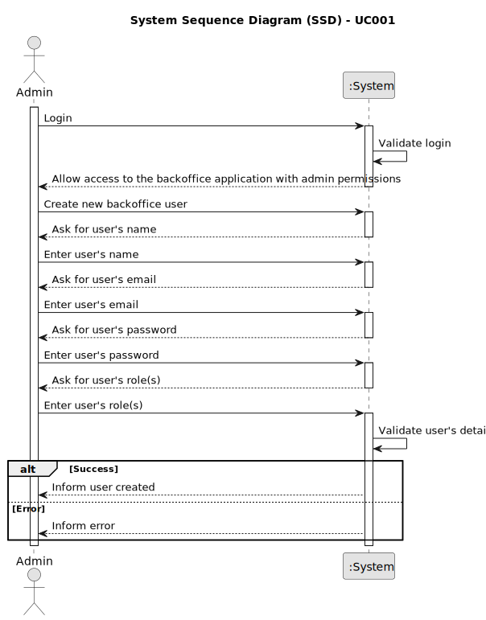

# UC041- As Customer, I want to be notified in my application when the state (phase) of my job openings changes.

## 1. Requirements Engineering

### 1.1. Use Case Description

- As Customer, I want to be notified in my application when the state (phase) of my  job openings changes.
---

### 1.2. Customer Specifications and Clarifications

**From the client clarifications:**

---

### 1.3. Acceptance Criteria

> AC001.1: IT needs to be notify in the applicattion .
>

---

### 1.4. Found out Dependencies

### 1.5 Input and Output Data

**Input Data:**
- Typed data:
	- name
	- email
- Automatic data:
	- password
- Selected data:
	- role

**Output Data:**
- Success or failure of the operation

### 1.6. System Sequence Diagram (SSD)

### 1.7 Other Relevant Remarks

- As said earlier, the user management functionality depends on the system's ability to authenticate users and manage roles appropriately.