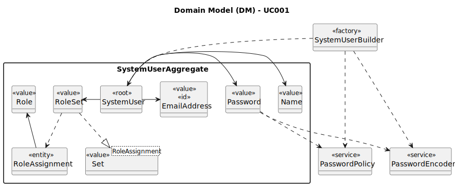

# UC001 - As Admin, I want to register users of the backoffice

## 2. Analysis

### 2.1. Relevant Domain Model Excerpt

The following diagram was extracted from the EAPLI framework (provided by the course's teachers).

### 2.2. Process Specification

#### 2.2.1. Normal Flow
1. **Authenticate Admin**: Verify that the Admin is logged in with appropriate permissions.
2. **Access User Management Interface**: Admin navigates to the user management section of the backoffice.
3. **Enter User Details**: Admin inputs the user's name and email and selects one or more roles from available options.
4. **Validate Inputs**: The system checks for the validity and uniqueness of the email.
5. **System Generates Password**: Automatically generate a secure password.
6. **Create User Account**: On successful validation, the system creates the user account and assigns the selected role(s).
7. **Confirmation to Admin**: Display a success message to the Admin upon successful registration or error messages if any step fails.

#### 2.2.2. Exceptional Flows
- **EF001.1**: If the email is already in use, the system informs the Admin and requests alternative information.
- **EF002.2**: If there is a system error during the account creation, notify the Admin of the failure and suggest retrying.

### 2.3. Functional Requirements Reevaluation
- **FR001.1**: The system shall allow the Admin to register new users by providing their name, email and role(s).
- **FR001.2**: The system shall validate the email address for uniqueness and format compliance.
- **FR001.3**: The system shall automatically generate a secure password for the user.
- **FR001.4**: The system shall create the user account with the provided details and assigned role(s).
- **FR001.5**: The system shall provide feedback to the Admin on the success or failure of the user registration process.
- **FR001.6**: The system shall handle exceptions, such as duplicate emails or system errors, with appropriate error messages.

### 2.4. Non-functional Requirements Specification
- **Security**: Assess encryption standards for storing and transmitting user credentials.
- **Performance**: Ensure user registration processes complete within acceptable time limits, maintaining system responsiveness.
- **Usability**: Interface should be intuitive, guiding the Admin smoothly through the registration process with clear instructions and error handling.

### 2.5. Data Integrity and Security
- Outline the security measures for data handling, particularly how personal data is protected in line with compliance requirements (e.g., GDPR).
- Detail encryption methods for password storage and secure transmission mechanisms for sensitive data.

### 2.6. Interface Design
- The interface will follow the EAPLI framework's design patterns, providing a user-friendly experience for the Admin.

### 2.7. Risk Analysis
- **R001.1**: Duplicate User Information
    - **Mitigation**: Implement robust validation checks within the system to ensure that all user emails are unique before creating an account.
- **R001.2**: System Error During Account Creation
  - **Mitigation**: Implement error handling mechanisms to notify the Admin of any system failures and provide guidance on how to proceed.
- **R001.3**: Unauthorized Access to User Data
  - **Mitigation**: Implement secure encryption standards for storing and transmitting user credentials to prevent unauthorized access.

### 2.8. Decisions
- **D001.1**: Confirm the automatic generation of passwords versus allowing Admins to set passwords, considering security implications.
- **D001.2**: Utilize role-based access control for user management, assigning to each user specific permissions based on their role.
- **D001.3**: Give the user the option to change the generated password upon first login for enhanced security.
- **D001.4**: Use the EAPLI framework classes and methods to facilitate the process.
- **D001.5**: Use the provided domain model as a reference for the user registration process.
- **D001.6**: Use the email as username to facilitate the user registration process (doing so, there's no need to change the provided code from the framework).